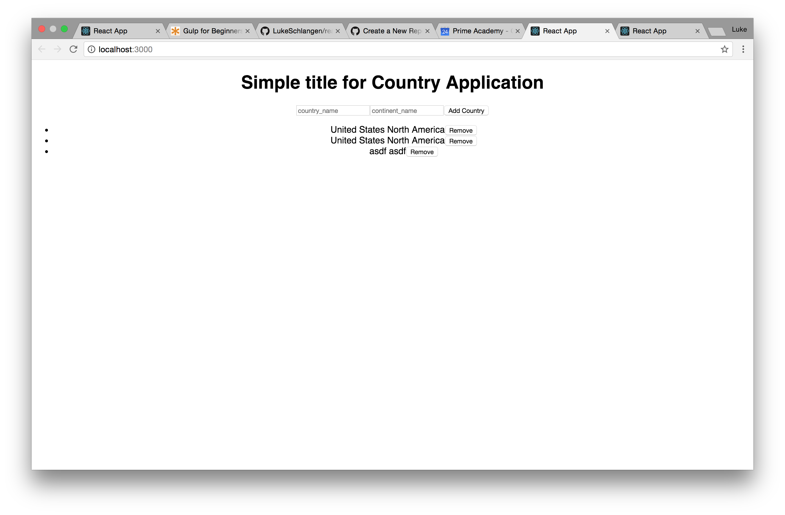

# React PostgreSQL

This application has the ability to Create, Read, and Update countries on a list.



## Getting Started


### Set up your PostgreSQL Database

This project expects a database to exist called `countries` with a table called `COUNTRY`

Create the `countries` database and then run the following SQL query

```SQL
CREATE TABLE COUNTRY (
    id serial primary key,
    country_name varchar(100),
    continent_name varchar(100)
);
```

### Clone the Repository

```bash
git clone https://github.com/PrimeAcademy/betelgeuse-introduction-to-react.git
```

navigate into repository

```bash
cd react-postgres-crd-app
```

### Install Dependencies

It's best to think of this as two separate projects, a react app and a server API. You must install dependencies for both the server (`pg-api`) and the client-side (`countries`) projects.

```bash
cd countries
npm install
cd ../pg-api
npm install
cd ..
```

### Start the Application

Again, it's best to think of this as two separate projects, a react app and a server API. You must start the server (`pg-api`) and the client-side (`countries`) projects.

```bash
cd pg-api
npm start
cd ../countries
npm start
cd ..
```

or to continuously live reload your server, you may use nodemon if you have it installed

```bash
cd ../pg-api
npm start
cd ..
nodemon countries/server.js
```

your server api should now be live on port 5000 and your client-side api should be visible at [http://localhost:3000/](http://localhost:3000/). If you are using nodemon, any changes you make to the server or the client side will automatically live reload - no need to restart the server every time!

## Acknowledgments

- based on the video here: https://www.youtube.com/watch?v=2oAS7MtMwqA
- from the repository here: https://github.com/cglsoft/react_postgreSQL.git
- edited for clarity and posted here
- Lecture from Prime Digital Academy on 10/27/2017


